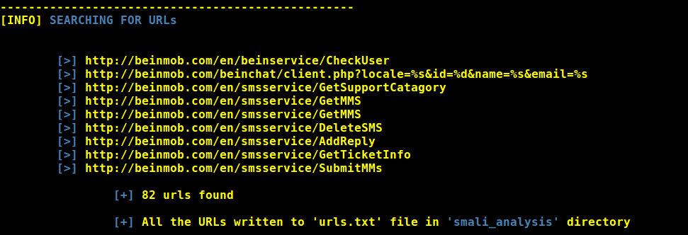

# ADHRIT  

   [](https://www.github.com/abhi-r3v0/Adhrit)  [](https://www.github.com/abhi-r3v0/Adhrit) 

Adhrit is an open source Android APK reversing and analysis tool that can help security researchers and CTF enthusiasts alike. The tool is an effort to cut down on the amount of time spent on reversing and basic reconnassaince of Android applications. The project is still under progress and will continually incorporate features with time. Feel free to report the issues. Feature requests and suggestions are always welcome! 

---

### USES:

* Extracts the apk contents.
* Disassembles native libraries
* Extracts jar out of dex.
* Extracts source code in Java.
* Extracts source code in Smali. 
* Recompiles smali into APK
* Sings the APK
* Checks for bytecode injection points.
* Analyzes permissions used by the application.
* Dumps the Manifest.
* Dumps the certificate details.
* Checks for malware footprints in VirusTotal database.  

---

### PRE-REQUISITES:

* Linux or MAC
* Java JDK

---

### USAGE:

1. Dowload the zip or clone the package and extract the tool ( ```git clone https://github.com/abhi-r3v0/Adhrit.git``` ).
2. Place the application in the tool directory. 
3. Open a terminal and cd into the directory.
4. Run ```python installer.py``` for installing the necessary tools.
5. Use ```python adhrit.py -h``` for usage help.

Example:  ```python adhrit.py -a my_app.apk```

---

### SCREENSHOTS:




---

### BLOG:

[bi0s](https://amritabi0s.wordpress.com/2017/09/24/adhrit-android-apk-reconnaissance-tool)

---

### MENTIONS:

* [Seclist](http://seclist.us/adhrit-is-an-open-source-android-apk-ripping-tool.html)
* [DedSec](https://www.dedsecinside.com/security/adhrit-android-recon-tool)
* [Howucan.gr](https://howucan.gr/scripts-tools/1531-adhrit-android-apk-ripping-tool-that-does-a-basic-recon-on-the-provided-apk-file)
* [HackerTor](https://hackertor.com/2016/12/30/adhrit-is-an-open-source-android-apk-ripping-tool/)
* [tuicool](https://www.tuicool.com/articles/r6jQzii)
* [Pinterest](https://in.pinterest.com/pin/396246467200088526/)
* [@androidtools on Twitter](https://twitter.com/search?q=%23androidtools%20adhrit&src=typd)
* [pcbbc](http://pcbbc.site.mobi/templates/mobile/facade_transcoder_iframe.php?u=%2Ftopics%2Fsmali%3Fimz_s%3Duresuqnlic5v64irhbuf1k8k94&lang=en)

---

### CREDITS:

* [apktool](https://ibotpeaches.github.io/Apktool/)
* [jarsigner](https://github.com/appium/sign)
* [dex2jar](https://github.com/pxb1988/dex2jar)
* [AXML2Printer](https://code.google.com/archive/p/android4me/downloads)
* [arm-objdump](https://linux.die.net/man/1/arm-linux-gnu-objdump)
* [jd-cli](https://github.com/kwart/jd-cmd)
* [aapt](https://developer.android.com/studio/command-line/index.html)

---

#### NOTE:

1. Filenames with two '.' may give an error. Please rename the apk in such cases.
For example, if your file name is ```my.app.apk```, rename it to ```myapp.apk```


