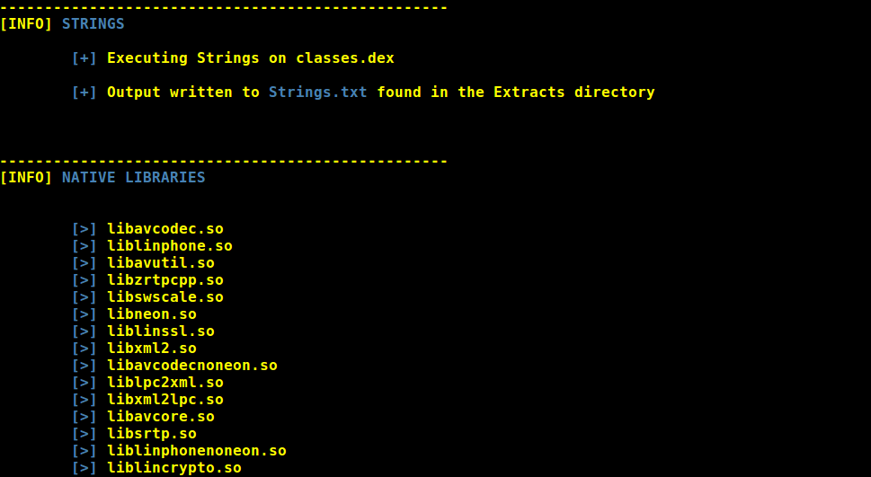
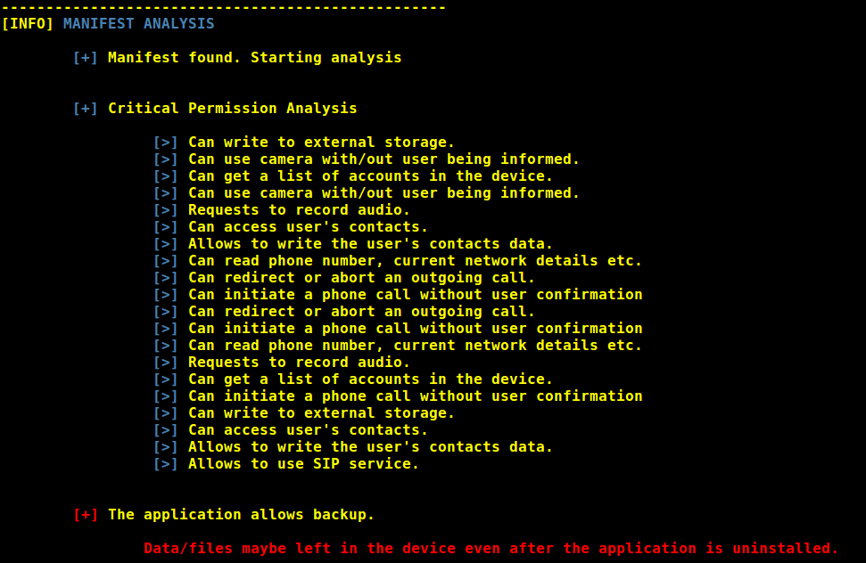

---

   [](https://www.github.com/abhi-r3v0/Adhrit)  [](https://www.github.com/abhi-r3v0/Adhrit)


Adhrit is an open source Android APK reversing and analysis tool that can help security researchers and CTF enthusiasts alike. The tool is an effort to cut down on the amount of time spent on reversing and basic reconnaissance of Android applications. The project is still under progress and will continually incorporate features with time. Feel free to report the issues. Feature requests and suggestions are always welcome! 

---

### USES:

* Extracts the apk contents.
* Disassembles native libraries
* Extracts jar out of dex.
* Extracts source code in Java.
* Extracts source code in Smali. 
* Recompiles smali into APK
* Signs the APK
* Checks for virtual apps/droppers
* Checks for bytecode injection points and write it to a file.
* Analyzes permissions used by the application.
* Dumps the Manifest.
* Dumps the certificate details.
* Checks for malware footprints in the VirusTotal database.  

---

### PRE-REQUISITES:

* Linux or MAC
* Java JDK

---

### USAGE:

1. Dowload the zip or clone the package and extract the tool ( ```git clone https://github.com/abhi-r3v0/Adhrit.git``` ).
2. Place the application in the tool directory. 
3. Open a terminal and cd into the directory.
4. Run ```python installer.py``` for installing the necessary tools.
5. Use ```python adhrit.py -h``` for usage help.

Example:  ```python adhrit.py -a my_app.apk```

---

### SCREENSHOTS:








---

### PRESENTATION:

[Cysinfo](https://cysinfo.com/12th-meetup-analysis-android-apk-using-adhrit/)

---

### BLOG:

[bi0s](https://amritabi0s.wordpress.com/2017/09/24/adhrit-android-apk-reconnaissance-tool)

---

## CONTRIBUTING:

* Have any cool idea? Here's how you can implement it:

1. Create a ```module_name.py``` and place it in the ```recons``` directory.
2. Define a class with a relevant name and define a function that takes```apk_name``` as a parameter. [eg: ```my_func(apk_name)```]
3. Open ```adhrit.py``` and import the new class from recons. You can look at the already existing imports as an example.
4. Define a new function inside the class ```Adhrit``` in this format: ```my_new_func(self, apk_name)```. Call the imported function here. [eg: ```my_func(apk_name)```]
5. Create a new argument in the argument parser for the new included ```my_new_func```
6. Call the function with the argument.

Voila! Send us a PR. We'll review it and add it to the project.

#### THINGS TO REMEMBER:

* Follow the pep8 conventions.
* Comment wherever necessary.

---

## THE SQUAD:

#### PROJECT LEAD:

* Abhishek J M (jmabhishek4@gmail.com, [@abhi_r3v0](https://twitter.com/abhi_r3v0))

#### LEAD CONTRIBUTORS:

* P S Narayanan (thepsnarayanan@gmail.com, [@0xP5N_](https://twitter.com/0xP5N_))
* Heeraj Nair (heeraj123@gmail.com, [@heerajnair](https://twitter.com/heerajnair))

#### GRAPHIC DESIGNS:

* Loyd Jayme (loydjayme1996@gmail.com, [@loydjayme25](https://github.com/loydjayme25))

---

### MENTIONS:

* [Troopers](https://twitter.com/WEareTROOPERS/status/965291867519770624)
* [Seclist](http://seclist.us/adhrit-is-an-open-source-android-apk-ripping-tool.html)
* [DedSec](https://www.dedsecinside.com/security/adhrit-android-recon-tool)
* [Howucan.gr](https://howucan.gr/scripts-tools/1531-adhrit-android-apk-ripping-tool-that-does-a-basic-recon-on-the-provided-apk-file)
* [HackerTor](https://hackertor.com/2016/12/30/adhrit-is-an-open-source-android-apk-ripping-tool/)
* [tuicool](https://www.tuicool.com/articles/r6jQzii)
* [Pinterest](https://in.pinterest.com/pin/396246467200088526/)
* [@androidtools on Twitter](https://twitter.com/search?q=%23androidtools%20adhrit&src=typd)
* [pcbbc](http://pcbbc.site.mobi/templates/mobile/facade_transcoder_iframe.php?u=%2Ftopics%2Fsmali%3Fimz_s%3Duresuqnlic5v64irhbuf1k8k94&lang=en)
* [Ethical Hacking Consultants](https://blog.ehcgroup.io/index.php/2018/03/30/adhrit-herramienta-de-analisis-e-inversion-de-android-apk-que-puede-ayudar-a-los-investigadores-de-seguridad-y-a-los-entusiastas-de-ctf-por-igual/)
* [Anonymoushacker](https://www.anonymoushacker.com.br/2018/04/adhrit-android-apk-reversao-e.html)
* [Pax0r](https://pax0r.com/feed-items/adhrit-android-apk-reversing-and-analysis-tool-that-can-help-secuity-researchers-and-ctf-enthusiasts-alike/)
* [KitPloit](https://www.kitploit.com/2018/03/adhrit-android-apk-reversing-and.html?utm_source=feedburner&utm_medium=feed&utm_campaign=Feed:+PentestTools+(PenTest+Tools))
* [NeOnSec](https://neonsec.com/adhrit-android-apk-analysis/)
* [ISEC](https://isec.ne.jp/wp-content/uploads/2018/04/120Adhrit.pdf)
* [Prodefence](http://www.prodefence.org/adhrit-android-apk-reversing-and-analysis-tool-that-can-help-secuity-researchers-and-ctf-enthusiasts-alike/)
* [appscan.io](https://open.appscan.io/article-905.html)
* [Weixin](https://mp.weixin.qq.com/s?__biz=MzI1ODEzMzIyOQ==&mid=2650996567&idx=1&sn=dbd6ecc33b969b466956c36861cbe045)
* [blackhatsecdevteam](https://blackhatsecdevteam.blogspot.in/2018/03/adhrit-android-apk-reversing-and.html)
* [360doc](http://www.360doc.com/content/18/0330/08/31784658_741433742.shtml)
* [Hackers Online Club](https://blog.hackersonlineclub.com/2018/04/adhrit-android-recon-tool.html?m=1)
* [Altervista](https://hakersketajne.altervista.org/1591/adhrit-the-android-recon-tool/2018/)
* [Xaunwulab](http://xuanwulab.github.io/cn/secnews/2018/03/30/index.html)


---

### CREDITS:

* [apktool](https://ibotpeaches.github.io/Apktool/)
* [jarsigner](https://github.com/appium/sign)
* [dex2jar](https://github.com/pxb1988/dex2jar)
* [AXML2Printer](https://code.google.com/archive/p/android4me/downloads)
* [arm-objdump](https://linux.die.net/man/1/arm-linux-gnu-objdump)
* [jd-cli](https://github.com/kwart/jd-cmd)
* [aapt](https://developer.android.com/studio/command-line/index.html)

---

#### NOTE:

1. Filenames with two '.' may give an error. Please rename the apk in such cases.
For example, if your file name is ```my.app.apk```, rename it to ```myapp.apk```

---

## From India, to the world :blue_heart:


