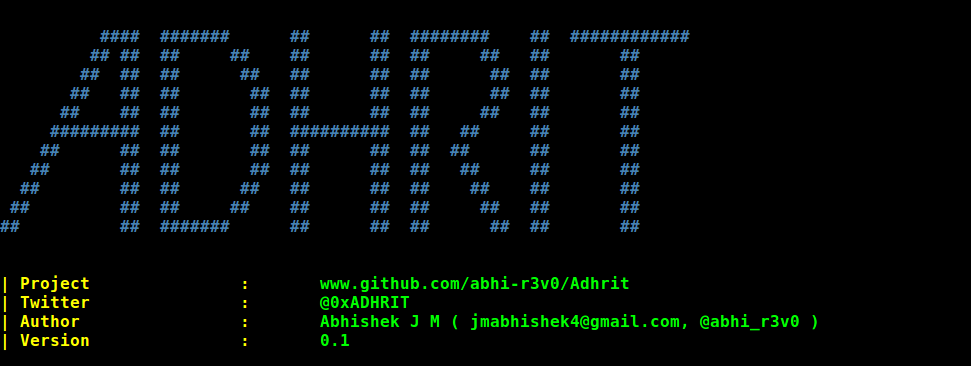
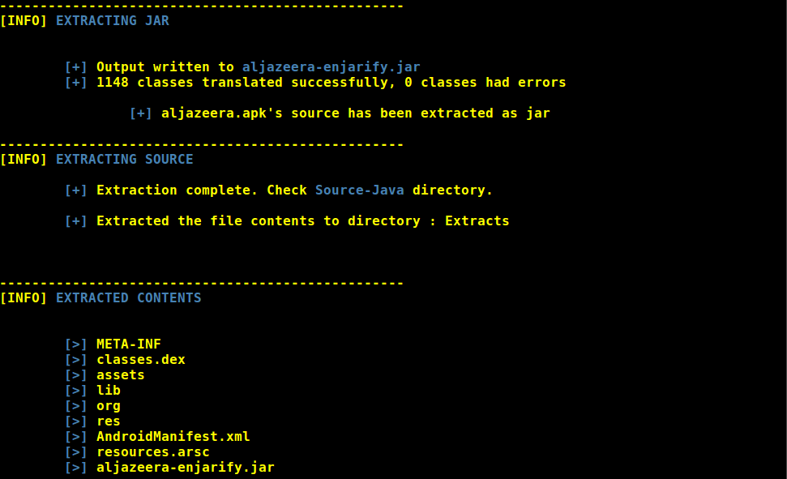

# ADHRIT
Adhrit is an open source Android APK ripping tool that does a basic recon on the provided APK file. Built mainly with CTFs on focus. 

## Uses:

* Extracts the apk contents.
* Disassembles native libraries
* Extracts jar out of dex.
* Extracts source code in Java.
* Extracts source code in Smali. 
* Recompiles smali into APK
* Checks for bytecode injection points.
* Analyzes permissions used by the application.
* Dumps the Manifest.
* Dumps the certificate details.
* Checks for malware footprints in VirusTotal database.  


## Pre-requisites:

* Linux or MAC
* Java JDK


## Usage:

1. Dowload the zip or clone the package and extract the tool ( ```git clone https://github.com/abhi-r3v0/Adhrit.git``` ).
2. Place the application in the tool directory. 
3. Open a terminal and cd into the directory.
4. Run ```python installer.py``` for installing the necessary tools.
5. Use ```python adhrit.py -h``` for usage help.

Example:  ```python adhrit.py -a my_app.apk```


## Screenshots:








## Blog:

[bi0s](https://amritabi0s.wordpress.com/2017/09/24/adhrit-android-apk-reconnaissance-tool)


## Mentions:

* [Seclist](http://seclist.us/adhrit-is-an-open-source-android-apk-ripping-tool.html)
* [DedSec](https://www.dedsecinside.com/security/adhrit-android-recon-tool)
* [Howucan.gr](https://howucan.gr/scripts-tools/1531-adhrit-android-apk-ripping-tool-that-does-a-basic-recon-on-the-provided-apk-file)
* [HackerTor](https://hackertor.com/2016/12/30/adhrit-is-an-open-source-android-apk-ripping-tool/)
* [tuicool](https://www.tuicool.com/articles/r6jQzii)
* [Pinterest](https://in.pinterest.com/pin/396246467200088526/)
* [@androidtools on Twitter](https://twitter.com/search?q=%23androidtools%20adhrit&src=typd)


#### Note:

1. Filenames with two '.' may give an error. Please rename the apk in such cases.
For example, if your file name is ```my.app.apk```, rename it to ```myapp.apk```


